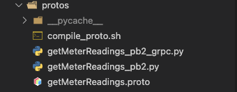
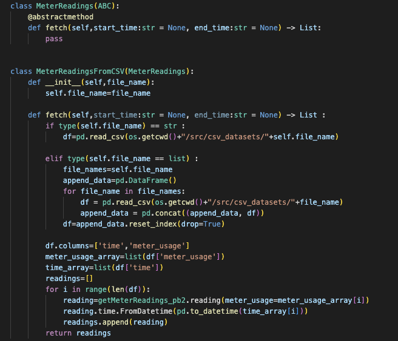
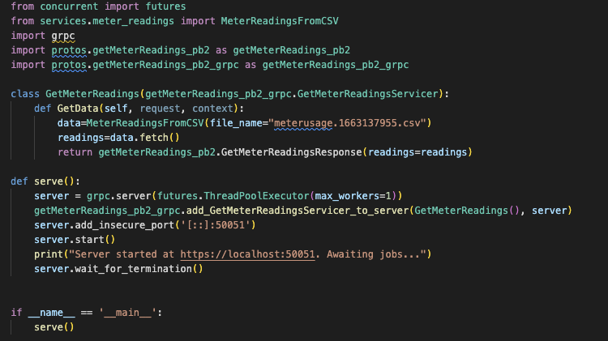
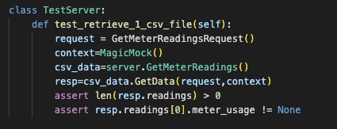
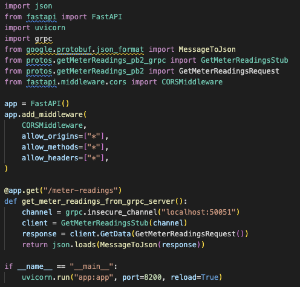
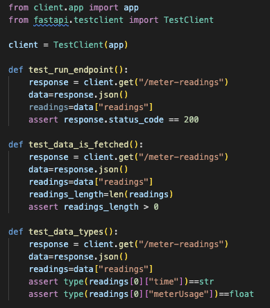
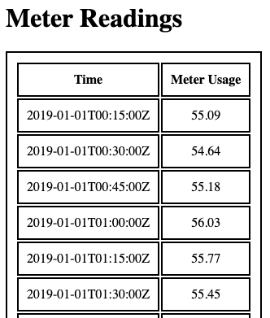

# grpc-project
A project that contains a grpc server, a client that uses the server and a html file which displays the data from the grpc server.

## Requirements

The project requires [Python 3.7](https://www.python.org/downloads/release/python-370/) or higher and
the [PIP](https://pip.pypa.io/en/stable/) package manager.

## Useful Python commands

### Install the project dependencies

```console
$ python3.7 -m pip install --requirement requirements.txt
```

### Run the GRPC server

```console
$ python3 src/server.py
```

### Run the client

```console
$ python3 client/app.py
```

### Run all tests using pytest
Note: To run all the tests successfully you must first run the grpc server, see below.
```console
$ python3 -m pytest
```

## Methodology

### 1. Created protobuf files which can be found in the /protos directory.
   


### 2. For better management of code, a /services folder was created to handle all the code related to fetching the meter readings.
   


 
### 3. Then the GRPC server was created which had the responsibility of fetching the CSV data of meter readings and serve the data.
   


### 4. Once the server was ready, a test was written to test the function used in the GRPC server.



### 5. Next, the client was created to fetch data from GRPC server, in this case FAST API was chosen as the client framework.



### 6. Integration tests were written to test how the client interacts with the GRPC server.



### 6. Finally a basic HTML page was created to view the data.


